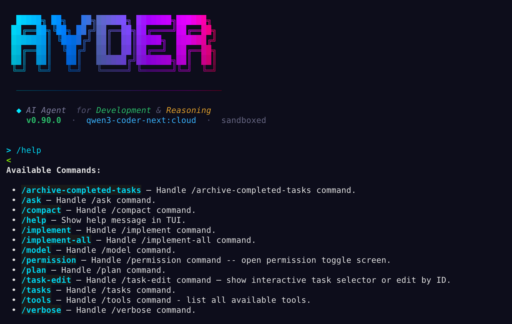

# ayder-cli

A multi-provider AI agent chat client for your terminal. Currently ayder supports

- [Ollama](https://ollama.com) 
- [Anthropic Claude](https://www.anthropic.com) 
- [OpenAI](https://openai.com/) 
- [Gemini](https://gemini.google.com/) 

or any OpenAI-compatible API and provides an autonomous coding assistant with file system tools and shell access.



## Why ayder-cli?

Most AI coding assistants require cloud APIs, subscriptions, or heavy IDE plugins. There are many cli coding agents there doing amazing things if you have tokens and subscriptions. ayder-cli takes a different approach:

- **Multi-provider** -- switch between Ollama (local/cloud), Anthropic Claude, Gemini or any OpenAI-compatible API with a single `/provider` command. Each provider has its own config section.
- **Fully local or cloud** -- run locally with Ollama (on your machine), or connect to Gemini, Anthropic, OpenAI, or cloud-hosted Ollama.
- **Agentic workflow** -- the LLM doesn't just answer questions. It can read files, edit code, run shell commands, and iterate on its own for configurable consecutive tool calls per user message (configurable with `-I`).
- **Textual TUI** -- a full dashboard interface with chat view, tool panel, slash command auto-completion, permission toggles, and tool confirmation modals with diff previews. 
- **Minimal dependencies** -- OpenAI SDK, Rich, and Textual. Gemini genai and for Gemini and Anthropic SDK optional for native  support.


### Tested Providers with Models 

| Provider | Location | Model                              |
|----------|----------|------------------------------------|
| ollama   | Cloud    | deepseek-v3.2:cloud                |
| ollama   | Cloud    | gemini-3-pro-preview:latest        |
| ollama   | Local    | glm-4.7-flash:latest               |
| ollama   | Cloud    | glm-4.7:cloud                      |
| ollama   | Cloud    | glm-5:cloud                        |
| ollama   | Local    | glm-ocr:latest                     |
| ollama   | Cloud    | gpt-oss:120b-cloud                 |
| ollama   | Cloud    | kimi-k2.5:cloud                    |
| ollama   | Cloud    | minimax-m2.5:cloud                 |
| ollama   | Local    | ministral-3:14b                    |
| ollama   | Cloud    | qwen3-coder-next:cloud             |
| ollama   | Cloud    | qwen3-coder:480b-cloud             |
| ollama   | Local    | qwen3-coder:latest                 |
| anthropic| Cloud    | claude-opus-4-6                    |
| anthropic| Cloud    | claude-sonnet-4-5-20250929         |
| anthropic| Cloud    | claude-haiku-4-5-20251001          |
| openai   | Cloud    | GPT-5.3-Codex                      |
| openai   | Cloud    | GPT-5.3-Codex-Spark                |
| openai   | Cloud    | GPT-5.2                            |
| openai   | Cloud    | GPT-5                              |
| gemini   | Cloud    | gemini-3-deep-think                |
| gemini   | Cloud    | gemini-3-pro                       |
| gemini   | Cloud    | gemini-3-flash                     |


### Tools

LLMs on their own can only generate text. To be a useful coding assistant, the model needs to *act* on your codebase. ayder-cli provides a modular `tools/` package that gives the model a set of real tools it can call:


Each tool has an OpenAI-compatible JSON schema so models that support function calling can use them natively. For models that don't, ayder-cli also parses a custom XML-like syntax (`<function=name><parameter=key>value</parameter></function>`) as a fallback.

  - **Path sandboxing**: All file operations are confined to the project root via `ProjectContext`. Path traversal attacks (`../`) and absolute paths outside the project are blocked.
  - **Safe mode** (TUI): The TUI supports a safe mode that blocks `write_file`, `replace_string`, `insert_line`, `delete_line`, `run_shell_command`, `run_background_process`, and `kill_background_process`.
  - Every tool call requires your confirmation before it runs -- you always stay in control. Use `-r`, `-w`, `-x` flags to auto-approve tool categories.
  - You may also prefer to run ayder-cli in a container for additional security.

## Installation

Requires Python 3.12+.
Works best with uv tool. if you don't have uv in your path get it from 
 [Astral uv](https://docs.astral.sh/uv/#highlights) 

```
# Install it to user environemnt

uv tool install ayder-cli

# or if no uv then create a a virtual environment first,
# activate it and install from PYPI

pip install ayder-cli

# For the nightly-builds:

# Clone the repo
git clone https://github.com/ayder/ayder-cli.git
cd ayder-cli

# Install in development mode
python3.12 -m venv .venv
source .venv/bin/activate
.venv/bin/pip install uv 

uv pip install -e .

# or (6 times slower)
pip install -e .

# Or works best as a uv tool (always on the path)
uv tool install -e .
```

### Ollama setup (default provider)

```bash
# Make sure Ollama is running with a model
ollama pull qwen3-coder
ollama serve

# Optional: optimize ollama for your model
export OLLAMA_CONTEXT_LENGTH=65536
export OLLAMA_FLASH_ATTENTION=true
export OLLAMA_MAX_LOADED_MODELS=1
```

### Anthropic setup (optional)

```bash
# Install the Anthropic SDK
pip install anthropic

# Set your API key in ~/.ayder/config.toml (see Configuration below)
# Then switch provider:
#   /provider anthropic
```

### Gemini setup (optional)

```bash
# Install the Google Generative AI SDK
pip install google-generativeai

# Set your API key in ~/.ayder/config.toml
# Then switch provider:
#   /provider gemini
```

## Configuration

On first run, ayder-cli creates a config file at `~/.ayder/config.toml`:

```toml
# Active provider: "openai", "anthropic", or "gemini"
provider = "openai"

[openai]
base_url = "http://localhost:11434/v1"
api_key = "ollama"
model = "qwen3-coder:latest"
num_ctx = 65536

[anthropic]
api_key = ""
model = "claude-sonnet-4-5-20250929"
num_ctx = 8192

[gemini]
api_key = ""
model = "gemini-2.0-flash"
num_ctx = 65536

[editor]
editor = "vim"

[ui]
verbose = false

[agent]
max_iterations = 50
```

Each provider has its own section. The top-level `provider` key selects which one is active. Use `/provider` in the TUI to switch at runtime.

Please adjust *num_ctx* context size window according to your local computer ram. If your ollama gets crash, decrease this 65536 value to a proper context size.

| Option | Section | Default | Description |
|--------|---------|---------|-------------|
| `provider` | top-level | `openai` | Active provider: `openai`, `anthropic`, or `gemini`. |
| `base_url` | `[openai]` | `http://localhost:11434/v1` | API endpoint. Works with any OpenAI-compatible server (Ollama, OpenAI, etc.). |
| `api_key` | per provider | `ollama` | API key. Set to `"ollama"` for local Ollama, or your Anthropic/OpenAI key. |
| `model` | per provider | varies | Model to use. Each provider section has its own default. |
| `num_ctx` | per provider | varies | Context window size in tokens. |
| `editor` | `[editor]` | `vim` | Editor launched by `/task-edit` command. |
| `verbose` | `[ui]` | `false` | When `true`, prints file contents after `write_file` and LLM request details before API calls. |
| `max_iterations` | `[agent]` | `50` | Maximum agentic iterations (tool calls) per user message (1-100). |
| `max_background_processes` | -- | `5` | Maximum number of concurrent background processes (1-20). |

## Usage

```bash
# Start (launches TUI by default)
ayder

# Or run as a module
python3 -m ayder_cli

```

### Command Mode (Non-Interactive)

```bash
# Execute a single command and exit
ayder "create a hello.py script"

# Pipe input (auto-detected, no flag needed)
echo "create a test.py file" | ayder

# Read from file
ayder -f instructions.txt
ayder --file instructions.txt

# Explicit stdin mode
ayder --stdin < prompt.txt
```

### Task Commands (CLI Mode)

Execute task-related commands directly without entering the TUI:

```bash
# List all tasks
ayder --tasks

# Implement a specific task by ID or name
ayder --implement 1
ayder --implement auth

# Implement all pending tasks sequentially
ayder --implement-all
```

### Tool Permissions (-r/-w/-x)

By default, every tool call requires user confirmation. Use permission flags to auto-approve tool categories:

| Flag | Category | Tools |
|------|----------|-------|
| `-r` | Read | `list_files`, `read_file`, `get_file_info`, `search_codebase`, `get_project_structure`, `load_memory`, `get_background_output`, `list_background_processes`, `list_tasks`, `show_task` |
| `-w` | Write | `write_file`, `replace_string`, `insert_line`, `delete_line`, `create_note`, `save_memory`, `manage_environment_vars`, `create_task`, `implement_task`, `implement_all_tasks` |
| `-x` | Execute | `run_shell_command`, `run_background_process`, `kill_background_process` |

```bash
# Auto-approve read-only tools (no confirmations for file reading/searching)
ayder -r

# Auto-approve read and write tools
ayder -r -w

# Auto-approve everything (fully autonomous)
ayder -r -w -x

# Combine with other flags
ayder -r -w "refactor the login module"
echo "fix the bug" | ayder -r -w -x
```

### Memory Management & Iteration Control

The agent can perform multiple consecutive tool calls per user message. However, as the conversation grows, LLM performance can degrade due to **context bloat** (context rot).

To solve this, `ayder` features an intelligent memory management system that summarizes conversation history based on a configurable iteration threshold.

#### Adjusting Iteration Threshold

You can tune how often the agent "compresses" its memory using the `-I` (Iteration) flag.

* **Small Models:** Use a lower value (e.g., `-I 50`) to keep the context lean and avoid logic errors.
* **Large/Powerful Models:** Use a higher value (e.g., `-I 200`) to maximize the model's reasoning capabilities before summarization.

#### Transferring Memory Between Models

If you switch models or providers mid-session, you can carry over your "knowledge" by manually triggering the memory system:

1. **Save current state:** `/save-memory`
2. **Switch provider or model:** `/provider anthropic` or `/model qwen3-coder:480b-cloud`
3. **Restore context:** `/load-memory`

```bash
# Allow up to 200 iterations for complex tasks
ayder -I 200

# Combine with permissions
ayder -r -w -I 150 "implement all pending tasks"
```
If you have memory problems decrease iteration size and /compact the LLM memory before it gets worse.

### Slash Commands

| Command | Description |
|---------|-------------|
| `/help` | Show available commands and keyboard shortcuts |
| `/tools` | List all tools and their descriptions |
| `/provider` | Switch LLM provider (openai, anthropic, gemini) with interactive selector |
| `/model` | List available models or switch model (e.g. `/model qwen2.5-coder`) |
| `/ask` | Ask a general question without using tools (e.g. `/ask explain REST vs GraphQL`) |
| `/plan` | Analyze request and create implementation tasks |
| `/tasks` | Browse and implement tasks from `.ayder/tasks/` |
| `/task-edit N` | Open task N in an in-app editor (e.g. `/task-edit 1`) |
| `/implement <id/name>` | Run a task by ID, name, or pattern (e.g. `/implement 1`) |
| `/implement-all` | Implement all pending tasks sequentially |
| `/verbose` | Toggle verbose mode (show file contents after `write_file` + LLM request details) |
| `/compact` | Summarize conversation, save to memory, clear, and reload context |
| `/save-memory` | Summarize conversation and save to `.ayder/memory/current_memory.md` (no clear) |
| `/load-memory` | Load memory from `.ayder/memory/current_memory.md` and restore context |
| `/archive-completed-tasks` | Move completed tasks to `.ayder/task_archive/` |
| `/permission` | Toggle permission levels (r/w/x) interactively |
| `exit` | Quit the application |

### Keyboard Shortcuts

| Shortcut | Action |
|----------|--------|
| `Ctrl+D` | Quit |
| `Ctrl+X` / `Ctrl+C` | Cancel current operation |
| `Ctrl+L` | Clear chat |
| `Tab` | Auto-complete slash commands |
| `Up/Down` | Navigate command history |

### Operational Modes

ayder-cli has three operational modes, each with a specialized system prompt and tool set:

#### Default Mode
The standard mode for general coding and chat. Uses the **System Prompt**.

```
> create a fibonacci function
# AI writes code, runs tests, etc.
```

**Available tools:** File read/write, shell commands, search, view tasks.

#### Planning Mode (`/plan`)
Activated with `/plan`. Uses the **Planning Prompt**. The AI becomes a "Task Master" focused solely on breaking down requirements into tasks.

```
> /plan add a user authentication to the app

# The agent will analyze the codebase and create tasks...
```

**Available tools:** Read-only exploration + `create_task`.

#### Task Mode (`/implement`)
Activated with `/implement`. Uses the **Task Prompt**. The AI focuses on implementing tasks from the task list.

```
> /implement 1

Running TASK-001: Add user authentication
# AI implements the task, then marks it done
```

**Available tools:** Full file system access + task management tools.

### Task Management

ayder-cli includes a built-in task system for structured development:

1. **Plan** (`/plan`) -- Break down requirements into tasks
2. **Implement** (`/implement`) -- Work through tasks one by one

Tasks are stored as markdown files in `.ayder/tasks/` using slug-based filenames for readability (e.g., `TASK-001-add-auth-middleware.md`). Legacy `TASK-001.md` filenames are also supported.

```
> /tasks
# Opens interactive task selector — pick a task to implement

> /task-edit 1    # opens TASK-001 in the in-app editor

> /implement 1
# AI implements TASK-001 and marks it as done

> /implement-all
# Sequentially implements all tasks one after each other. Consider iteration size!
```

### Code Search

ayder-cli provides code search capabilities via the `search_codebase` tool. The LLM calls it automatically when you ask it to search for patterns, function definitions, or usages across the codebase.

### Pluggable Tool Architecture

ayder-cli features a **pluggable tool system** with dynamic auto-discovery. Adding a new tool is as simple as:

1. **Create a definition file**: `src/ayder_cli/tools/mytool_definitions.py`
2. **Implement the tool function**: Add your logic
3. **Done!** Auto-discovery automatically registers the tool

The tool system automatically:
- Discovers all `*_definitions.py` files
- Validates for duplicates and required tools
- Registers tools with the LLM
- Handles imports and exports

Current tool categories (25 tools total):
- **Filesystem**: list_files, read_file, write_file, replace_string, insert_line, delete_line, get_file_info
- **Search**: search_codebase, get_project_structure
- **Shell**: run_shell_command
- **Memory**: save_memory, load_memory
- **Notes**: create_note
- **Background Processes**: run_background_process, get_background_output, kill_background_process, list_background_processes
- **Tasks**: list_tasks, show_task
- **Environment**: manage_environment_vars
- **Virtual Environments**: create_virtualenv, install_requirements, list_virtualenvs, activate_virtualenv, remove_virtualenv

## License

MIT
