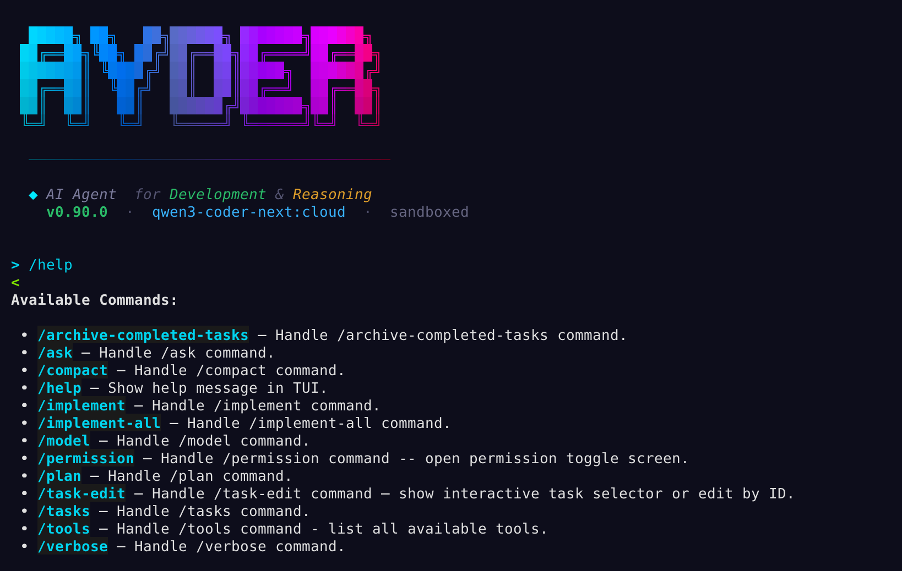

# ayder-cli

A multi-provider AI agent chat client for your terminal. ayder supports Ollama, Anthropic Claude, OpenAI, Gemini,
or any OpenAI-compatible API and provides an autonomous coding assistant with file system tools and shell access.



## Supported LLM providers

- [Ollama](https://ollama.com) (local or cloud)
- [Anthropic Claude](https://www.anthropic.com)
- [OpenAI](https://openai.com/)
- [Gemini](https://gemini.google.com/)
- [DeepSeek](https://deepseek.com/) (via OpenAI-compatible driver)
- [Qwen](https://qwen.ai/) (via DashScope native driver)
- [GLM / ChatGLM](https://open.bigmodel.cn/) (via ZhipuAI native driver)

## Why ayder-cli?

Most AI coding assistants require cloud APIs, subscriptions, or heavy IDE plugins. ayder-cli takes a different approach:

- **Multi-provider** -- switch between Ollama, Anthropic Claude, Gemini, or any OpenAI-compatible API with a single `/provider` command. Each provider has its own config profile.
- **7 native drivers** -- Ollama, OpenAI, Anthropic, Gemini, DeepSeek, Qwen (DashScope), and GLM (ZhipuAI). Each driver guarantees native tool calling and streaming support.
- **Fully local or cloud** -- run locally with Ollama, or connect to any cloud provider.
- **Agentic workflow** -- the LLM reads files, edits code, runs shell commands, and iterates autonomously with configurable iteration limits per message.
- **Multi-agent** -- define specialized sub-agents in `config.toml`. Each agent runs independently with its own LLM, model, and context. Results are injected back into the main conversation when complete.
- **Textual TUI** -- an inline terminal interface with chat view, tool panel, thinking block toggle, slash command auto-completion, permission toggles, and tool confirmation modals with diff previews.
- **Minimal dependencies** -- OpenAI SDK, Rich, and Textual. Other provider SDKs are optional.

### Tested Providers with Models

| Provider | Location | Model |
| -------- | -------- | ----- |
| ollama | Cloud | deepseek-v3.2:cloud |
| ollama | Cloud | gemini-3-pro-preview:latest |
| ollama | Local | glm-4.7-flash:latest |
| ollama | Cloud | glm-4.7:cloud |
| ollama | Cloud | glm-5:cloud |
| ollama | Local | glm-ocr:latest |
| ollama | Cloud | gpt-oss:120b-cloud |
| ollama | Cloud | kimi-k2.5:cloud |
| ollama | Cloud | minimax-m2.5:cloud |
| ollama | Local | ministral-3:14b |
| ollama | Cloud | qwen3-coder-next:cloud |
| ollama | Cloud | qwen3-coder:480b-cloud |
| ollama | Local | qwen3-coder:latest |
| anthropic | Cloud | claude-opus-4-6 |
| anthropic | Cloud | claude-sonnet-4-5-20250929 |
| anthropic | Cloud | claude-haiku-4-5-20251001 |
| openai | Cloud | GPT-5.3-Codex |
| openai | Cloud | GPT-5.3-Codex-Spark |
| openai | Cloud | GPT-5.2 |
| openai | Cloud | GPT-5 |
| gemini | Cloud | gemini-3-deep-think |
| gemini | Cloud | gemini-3-pro |
| gemini | Cloud | gemini-3-flash |

### Tools

LLMs on their own can only generate text. To be a useful coding assistant, the model needs to *act* on your codebase. ayder-cli provides 25 tools across 10 categories that the model can call:

Each tool has an OpenAI-compatible JSON schema so models that support function calling can use them natively. For models that don't, ayder-cli also parses a custom XML-like syntax (`<function=name><parameter=key>value</parameter></function>`) as a fallback.

- **Path sandboxing**: All file operations are confined to the project root via `ProjectContext`. Path traversal attacks (`../`) and absolute paths outside the project are blocked.
- **Safe mode** (TUI): Blocks `file_editor`, `run_shell_command`, `run_background_process`, `kill_background_process`, and `fetch_web`.
- Every tool call requires your confirmation before it runs -- you always stay in control. Use `-r`, `-w`, `-x` flags to auto-approve tool categories.
- You may also prefer to run ayder-cli in a container for additional security.

## Installation

Requires Python 3.12+.
Works best with uv tool. If you don't have uv in your path, get it from
 [Astral uv](https://docs.astral.sh/uv/#highlights)

```bash
# Install to user environment
uv tool install ayder-cli

# or install from PyPI
pip install ayder-cli

# For nightly builds:
git clone https://github.com/ayder/ayder-cli.git
cd ayder-cli

# Install in development mode
python3.12 -m venv .venv
source .venv/bin/activate
uv pip install -e .

# Or as a uv tool (always on the path)
uv tool install -e .
```

### Ollama setup (default provider)

```bash
# Make sure Ollama is running with a model
ollama pull qwen3-coder
ollama serve

# Optional: optimize Ollama for your model
export OLLAMA_CONTEXT_LENGTH=65536
export OLLAMA_FLASH_ATTENTION=true
export OLLAMA_MAX_LOADED_MODELS=1
```

### Anthropic setup (optional)

```bash
# Install the Anthropic SDK
pip install anthropic

# Set your API key in ~/.ayder/config.toml (see Configuration below)
# Then switch provider:
#   /provider anthropic
```

### Gemini setup (optional)

```bash
# Install the Google Generative AI SDK
pip install google-generativeai
```

Set your API key in `~/.ayder/config.toml`, then switch provider: `/provider gemini`

### Configuration: Profiles and Drivers

ayder-cli uses a flexible profile-based configuration system. On the first run, it creates a config file at `~/.ayder/config.toml`.

**Key Concepts:**
- **Profile Name:** A custom named section (e.g., `[llm.my_ollama]`). You can define as many profiles as you want.
- **Driver:** The underlying native SDK or adapter used by the profile (`ollama`, `openai`, `anthropic`, `google`, `deepseek`, `qwen`, or `glm`). Each driver guarantees full support for native tool calling and streaming.
- **Active Provider:** The `provider` setting under `[app]` determines which profile is currently active.
- **Chat Protocol:** By default, all drivers use native tool calling (`chat_protocol = "ollama"`). If you encounter a model that fails to trigger tools natively, you can set `chat_protocol = "xml"` in that profile to force an XML-based fallback.

#### Example: Running the Same Model via Different Drivers

Because profiles are just names, you can configure the same model to run through different drivers:

```toml
config_version = "2.0"

[app]
provider = "qwen_local" # <--- Currently using the local Ollama version

# --- Profiles ---

# 1. Local Qwen via Ollama driver
[llm.qwen_local]
driver = "ollama"
base_url = "http://localhost:11434"
model = "qwen2.5-coder:latest"
num_ctx = 65536

# 2. Cloud Qwen via OpenAI driver (e.g., DeepInfra, Together)
[llm.qwen_cloud]
driver = "openai"
base_url = "https://api.deepinfra.com/v1/openai"
api_key = "sk-..."
model = "Qwen/Qwen2.5-Coder-32B-Instruct"
num_ctx = 65536
```

In the TUI, typing `/provider qwen_cloud` seamlessly switches from your local GPU to the cloud endpoint.

#### Full Configuration Reference

```toml
config_version = "2.0"

[app]
provider = "openai"           # Active provider profile name
editor = "vim"                # Editor for /task-edit command
verbose = false               # Show file contents after write + LLM debug
max_background_processes = 5  # Max concurrent background processes (1-20)
max_iterations = 10           # Max agentic iterations per message (1-100)
max_output_tokens = 4096      # Max tokens in LLM response
max_history_messages = 30     # Messages kept in history
prompt = "STANDARD"           # System prompt tier: MINIMAL, STANDARD, EXTENDED
tool_tags = ["core", "metadata"]  # Enabled tool tags (see /plugin)
agent_timeout = 300           # Seconds before a background agent is cancelled

[logging]
file_enabled = true
file_path = ".ayder/log/ayder.log"
rotation = "10 MB"
retention = "7 days"

[context_manager]
enabled = false
max_context_tokens = 8192

[temporal]
enabled = false
host = "localhost:7233"
namespace = "default"
metadata_dir = ".ayder/temporal"

# --- Provider Profiles ---

[llm.my_local_ollama]
driver = "ollama"
base_url = "http://localhost:11434"
model = "qwen3-coder:latest"
num_ctx = 65536

[llm.openai_cloud]
driver = "openai"
api_key = "sk-..."
model = "gpt-4o"
num_ctx = 128000

[llm.anthropic]
driver = "anthropic"
api_key = "sk-ant-..."
model = "claude-sonnet-4-5-20250929"
num_ctx = 200000

[llm.gemini]
driver = "google"
api_key = "AIza..."
model = "gemini-3-pro"
num_ctx = 1000000
```

Please adjust `num_ctx` context size window according to your local computer RAM. If Ollama crashes, decrease the value.

### Changing Models on the Fly (`/model`)

You do **not** need a separate profile for every model. The profile defines the *connection* (driver, base URL, API key).

Once a profile is active, use `/model` in the TUI to swap models on the fly:

- **Interactive Picker:** `/model` with no arguments queries the active driver for available models and opens a picker.
- **Direct Switch:** `/model <model-name>` immediately switches to that model.

Changes made with `/model` apply to the current session only. To make a model the permanent default, update `model = "..."` in your `config.toml`.

## Usage

```bash
# Start (launches TUI by default)
ayder

# Or run as a module
python3 -m ayder_cli
```

### Command Mode (Non-Interactive)

```bash
# Execute a single command and exit
ayder "create a hello.py script"

# Pipe input (auto-detected, no flag needed)
echo "create a test.py file" | ayder

# Read from file
ayder -f instructions.txt

# Explicit stdin mode
ayder --stdin < prompt.txt

# Use a custom system prompt file
ayder --prompt prompt-file.md "refactor this code"
```

### Task Commands (CLI Mode)

Execute task-related commands directly without entering the TUI:

```bash
# List all tasks
ayder --tasks

# Implement a specific task by ID or name
ayder --implement 1
ayder --implement auth

# Implement all pending tasks sequentially
ayder --implement-all
```

### Tool Permissions (-r/-w/-x/--http)

By default, every tool call requires user confirmation. Use permission flags to auto-approve tool categories:

| Flag | Category | Tools |
| ---- | -------- | ----- |
| `-r` | Read | `file_explorer`, `read_file`, `search_codebase`, `get_project_structure`, `load_memory`, `get_background_output`, `list_background_processes`, `list_tasks`, `show_task`, `list_virtualenvs`, `activate_virtualenv` |
| `-w` | Write | `file_editor`, `create_note`, `save_memory`, `manage_environment_vars`, `python_editor`, `temporal_workflow` |
| `-x` | Execute | `run_shell_command`, `run_background_process`, `kill_background_process`, `create_virtualenv`, `install_requirements`, `remove_virtualenv` |
| `--http` | Web/Network | `fetch_web`, `dbs_tool` |

```bash
# Auto-approve read-only tools
ayder -r

# Auto-approve read and write tools
ayder -r -w

# Auto-approve everything (fully autonomous)
ayder -r -w -x

# Allow web tools without prompts
ayder -r --http

# Combine with other flags
ayder -r -w "refactor the login module"
echo "fix the bug" | ayder -r -w -x
```

### Context Management

As conversations grow, LLM performance degrades due to context bloat — long tool results, stale history, and repeated context eat into the model's usable window. ayder-cli includes a built-in context manager that solves this automatically. Every message is assigned an importance tier (system > recent user > recent assistant > tool results > old history), and when the conversation approaches the token budget the manager compresses old tool results (JSON outputs are structurally summarized, large text is head/tail truncated) and prunes the lowest-priority messages first. Tool call + tool result pairs are kept as atomic units so the model never sees orphaned results. If `tiktoken` is installed, token counts are exact; otherwise a character-based heuristic is used (~4 chars/token for text, ~3.5 for code).

The context manager is enabled by default and configured under `[context_manager]` in `config.toml`. The defaults work well for most setups, but here are the knobs you can tune:

| Setting | Default | Description |
|---------|---------|-------------|
| `enabled` | `true` | Master switch. Set `false` to disable all automatic management. |
| `max_context_tokens` | `8192` | Total token budget for the conversation. Set this to match your model's context window (e.g., `65536` for qwen3-coder, `200000` for Claude). |
| `reserve_ratio` | `0.30` | Fraction of the budget reserved for the LLM response. A 30% reserve on 65k tokens means ~45k tokens are available for history. |
| `summarization_threshold` | `0.70` | When utilization exceeds this ratio, the manager triggers summarization. |
| `compression_threshold` | `0.50` | When utilization exceeds this ratio, old tool results are compressed. |
| `tool_result_compress_age` | `5` | Tool results older than N messages are eligible for compression. |
| `max_tool_result_length` | `2048` | Maximum character length for a compressed tool result. |
| `compress_tool_results` | `true` | Enable automatic tool result compression. |

For small local models (7B-14B), lower `max_context_tokens` to match the model's actual window and reduce `reserve_ratio` to `0.20` so more history fits. For large cloud models, increase `max_context_tokens` and raise `summarization_threshold` to `0.80` to delay summarization and let the model use its full reasoning capacity. You can also manually manage context with `/save-memory`, `/load-memory`, and `/compact`.

### Slash Commands

| Command | Description |
| ------- | ----------- |
| `/help` | Show available commands and keyboard shortcuts |
| `/provider` | Switch LLM provider (interactive selector or direct name) |
| `/model` | List available models or switch model (e.g., `/model qwen3-coder`) |
| `/plugin` | Toggle tool plugins by tag (e.g., venv, http, background, python, dbs) |
| `/tools` | List currently enabled tools and descriptions |
| `/permission` | Toggle permission levels (r/w/x/http) interactively |
| `/ask` | Ask a general question without using tools |
| `/plan` | Analyze request and create implementation tasks |
| `/tasks` | Browse and implement tasks from `.ayder/tasks/` |
| `/implement [id]` | Interactive task picker, or implement by ID (e.g., `/implement 1`) |
| `/notes` | Browse and edit markdown notes |
| `/skill` | Activate a domain skill from `.ayder/skills/` |
| `/verbose` | Toggle verbose mode |
| `/logging` | Set log level for current session (NONE, ERROR, WARNING, INFO, DEBUG) |
| `/compact` | Summarize conversation, save to memory, clear, and reload context |
| `/save-memory` | Summarize conversation and save to memory (no clear) |
| `/load-memory` | Load memory and restore context |
| `/archive-completed-tasks` | Move completed tasks to `.ayder/task_archive/` |
| `/temporal` | Start/status Temporal queue worker |
| `/agent list` | List configured agents and their current status |
| `/agent <name> <task>` | Dispatch an agent to run a task in the background |
| `/agent cancel <name>` | Cancel a running agent |

### Logging

- Default: when logging is enabled, logs go to `.ayder/log/ayder.log` (not shown on screen).
- TUI `/logging` changes are session-only and do not modify `config.toml`.
- CLI `--verbose [LEVEL]` enables stdout logging for that run.

### Keyboard Shortcuts

| Shortcut | Action |
| -------- | ------ |
| `Ctrl+Q` | Quit |
| `Ctrl+X` / `Ctrl+C` | Cancel current operation |
| `Ctrl+L` | Clear chat |
| `Ctrl+O` | Toggle tool panel |
| `Ctrl+T` | Toggle thinking/reasoning blocks |
| `PageUp` / `PageDown` | Scroll chat view |
| `Tab` | Auto-complete slash commands |

## Efficiency & Optimization

ayder-cli is optimized for both large and small (local) LLMs:

- **Dynamic Tool Loading**: Only `core` and `metadata` tools are loaded by default. Use `/plugin` to enable specialized toolsets (venv, python, http, background, dbs, temporal, env) only when needed.
- **Tiered Prompts**: Use `prompt = "MINIMAL"` in config for smaller models (7B-14B) to strip complex reasoning frameworks and improve follow-through.
- **Automatic Context Bounding**: Conversation history is bounded based on `max_history_messages` to prevent context rot.
- **Tool System Prompts**: Tool-specific prompt blocks (e.g., DBS instructions) are only injected when their tag is enabled, keeping the system prompt lean.

## Operational Modes

### Default Mode

The standard mode for general coding and chat. Uses the system prompt.

```
> create a fibonacci function
```

Available tools: File read/write, shell commands, search, memory, notes, tasks.

### Planning Mode (`/plan`)

Activated with `/plan`. The AI breaks down requirements into tasks stored in `.ayder/tasks/`.

```
> /plan add user authentication to the app
```

### Task Mode (`/implement`)

Activated with `/implement`. The AI implements tasks from the task list.

```
> /implement        # Interactive task picker
> /implement 1      # Implement TASK-001 directly
```

### Task Management

ayder-cli includes a built-in task system:

1. **Plan** (`/plan`) -- Break down requirements into tasks
2. **Implement** (`/implement`) -- Work through tasks one by one
3. **Archive** (`/archive-completed-tasks`) -- Move done tasks to archive

Tasks are stored as markdown files in `.ayder/tasks/` using slug-based filenames (e.g., `TASK-001-add-auth-middleware.md`).

```
> /tasks            # Interactive task browser
> /task-edit 1      # Open TASK-001 in the in-app editor
> /implement 1      # Implement TASK-001
```

### Pluggable Tool Architecture

Adding a new tool is as simple as:

1. **Create a definition file**: `src/ayder_cli/tools/builtins/mytool_definitions.py`
2. **Implement the tool function**: Add your logic in a corresponding `.py` file
3. **Done!** Auto-discovery registers the tool automatically

The tool system:
- Discovers all `*_definitions.py` files automatically
- Validates for duplicate names and required tools
- Registers tools with the LLM via OpenAI-compatible schemas
- Supports tag-based filtering for dynamic enable/disable
- Injects tool-specific system prompts when enabled

**Current tool categories (25 tools):**

| Category | Tools |
|----------|-------|
| **Filesystem** | `file_explorer`, `read_file`, `file_editor` |
| **Search** | `search_codebase`, `get_project_structure` |
| **Shell** | `run_shell_command` |
| **Python Editor** | `python_editor` (CST-based structural code manipulation) |
| **Memory** | `save_memory`, `load_memory` |
| **Notes** | `create_note` |
| **Background Processes** | `run_background_process`, `get_background_output`, `kill_background_process`, `list_background_processes` |
| **Tasks** | `list_tasks`, `show_task` |
| **Environment** | `manage_environment_vars` |
| **Virtual Environments** | `create_virtualenv`, `install_requirements`, `list_virtualenvs`, `activate_virtualenv`, `remove_virtualenv` |
| **Web** | `fetch_web` |
| **DBS** | `dbs_tool` (RAG API for DBS-related queries) |
| **Workflow** | `temporal_workflow` |
| **Agents** | `call_agent` (dispatch a named agent to run a task in the background) |

## Multi-Agent System

ayder-cli supports user-defined **specialized agents**: each agent is an independent AI loop with its own LLM provider, model, system prompt, and context window. Agents run as background tasks — they never block the main conversation and their results are automatically injected back when they complete.

### How Agents Work

```
Main LLM (your conversation)
    │
    ├─ calls `call_agent` tool  ─────────────────────────────────┐
    │   OR you type `/agent <name> <task>`                       │
    │                                                            ▼
    │                                            AgentRunner (background asyncio task)
    │                                            ┌─────────────────────────────────┐
    │                                            │  Isolated ChatLoop              │
    │                                            │  • own LLM provider + model     │
    │                                            │  • own context window           │
    │                                            │  • own ToolRegistry             │
    │                                            │  • auto-approves all tools      │
    │                                            │  • produces <agent-summary>     │
    │                                            └────────────────┬────────────────┘
    │                                                             │ completes
    │                                                             ▼
    │                                            AgentSummary → _summary_queue
    │
    ▼ (next main LLM turn)
pre_iteration_hook drains queue
    └─ injects AgentSummary as system message into main context
         └─ main LLM sees: "[Agent 'reviewer' completed] FINDINGS: ..."
```

Key properties:
- **Separate context** — agents have no access to the main conversation history. They receive only their system prompt and the task description.
- **Non-blocking** — dispatching an agent returns immediately. Both `/agent` and `call_agent` are fire-and-forget.
- **Concurrent** — multiple agents can run simultaneously, each in its own async task.
- **Summary injection** — when an agent finishes, its structured `<agent-summary>` block is injected as a system message into the main LLM's context at the start of the next turn.
- **Timeout** — agents are automatically cancelled after `agent_timeout` seconds (default: 300).

### Configuring Agents

Add `[agents.<name>]` sections to your `~/.ayder/config.toml`:

```toml
[app]
provider = "ollama"
agent_timeout = 300           # Global timeout for all agents (seconds)

[llm.ollama]
driver = "ollama"
model = "qwen3-coder:latest"
num_ctx = 65536

[llm.anthropic]
driver = "anthropic"
api_key = "sk-ant-..."
model = "claude-sonnet-4-5-20250929"
num_ctx = 200000

# --- Agents ---

[agents.code-reviewer]
system_prompt = """You are a senior code reviewer. Review the code for bugs,
security issues, and style violations. Be concise and actionable."""
provider = "anthropic"         # Optional: use a different provider than main
model = "claude-sonnet-4-5-20250929"  # Optional: use a different model

[agents.test-writer]
system_prompt = """You are a test engineer. Write comprehensive pytest tests
for the code provided. Follow existing test patterns in the codebase."""
# No provider/model → inherits from [app] provider

[agents.doc-writer]
system_prompt = """You are a technical writer. Write clear, concise docstrings
and inline comments for the code provided."""
```

Each agent field:

| Field | Required | Description |
|-------|----------|-------------|
| `system_prompt` | Yes | The agent's role and instructions |
| `provider` | No | LLM provider profile name (inherits from `[app]` if omitted) |
| `model` | No | Model name override (inherits from provider profile if omitted) |

### Using Agents

**From the TUI (slash commands):**

```
# List configured agents and their status
/agent list

# Dispatch an agent to review your authentication module
/agent code-reviewer Review src/auth.py for security issues

# Dispatch the test writer for a specific module
/agent test-writer Write tests for src/api/users.py

# Cancel a running agent
/agent cancel code-reviewer
```

**Via the main LLM (automatic):**

When agents are configured, the main LLM is told about them via its system prompt and can call `call_agent` autonomously:

```
You: Review the authentication module and write tests for it.

LLM: I'll dispatch two agents to handle this in parallel.
     [calls call_agent: name="code-reviewer", task="Review src/auth.py..."]
     [calls call_agent: name="test-writer", task="Write tests for src/auth.py..."]

     Both agents are running in the background. I'll incorporate
     their findings when they complete.

... (agents run independently) ...

LLM: [next turn, after agents complete]
     The code-reviewer found 2 issues: ...
     The test-writer produced 8 new tests: ...
```

**Agent summary format:**

Agents end their final response with a structured block that ayder-cli parses:

```
<agent-summary>
FINDINGS: Found a SQL injection vulnerability in login() and missing input validation in register()
FILES_CHANGED: none
RECOMMENDATIONS: Parameterize all DB queries; add Pydantic validators to all endpoints
</agent-summary>
```

This summary is injected into the main LLM's context as a system message so the main agent can act on it, summarize it for you, or chain it to further work.

## Plugins

Official plugins (venv, python, dbs, mcp, temporal) are maintained in the **[ayder/ayder-plugins](https://github.com/ayder/ayder-plugins)** repository. Install any plugin directly from GitHub:

```bash
ayder install-plugin https://github.com/ayder/ayder-plugins/tree/main/venv-tools
ayder install-plugin https://github.com/ayder/ayder-plugins/tree/main/python-tools
```

Plugins can also be hosted in any public GitHub repository — point `install-plugin` at any repo or subdirectory containing a `plugin.toml`.

## License

MIT
